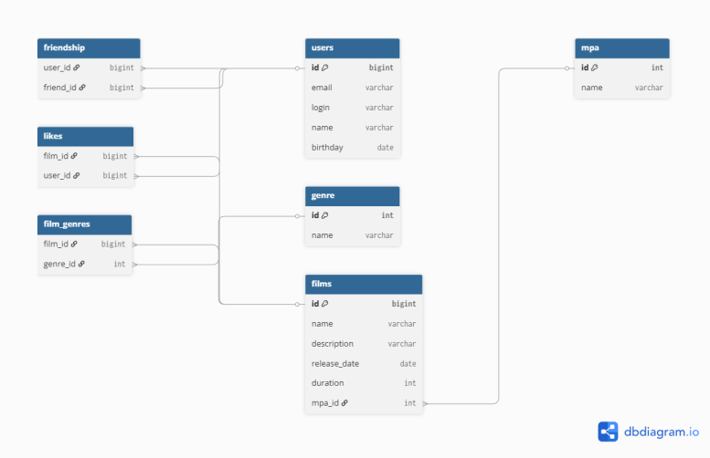

# Filmorate — схема базы данных



## Описание
Схема отражает структуру базы данных для приложения Filmorate, включая:
- Пользователей и фильмы,
- Жанры и рейтинг MPA,
- Лайки и дружбу с подтверждением.

## Примеры SQL-запросов

### Получить топ-10 популярных фильмов
```sql
SELECT f.id, f.name, COUNT(l.user_id) AS likes_count
FROM films f
LEFT JOIN likes l ON f.id = l.film_id
GROUP BY f.id
ORDER BY likes_count DESC
LIMIT 10;
```

### Получить всех друзей пользователя (например, id = 123)
```sql
SELECT u.*
FROM users u
JOIN friendship f ON (
    (f.requester_id = 123 AND f.recipient_id = u.id AND f.status = 'CONFIRMED')
    OR
    (f.recipient_id = 123 AND f.requester_id = u.id AND f.status = 'CONFIRMED')
);
```